# 🏛️UBA Engineering Thesis Template🏛️

[](https://opensource.org/licenses/MIT)
[](https://www.latex-project.org/)
[](#contributing)


This repository provides a professionally formatted LaTeX thesis/dissertation template specifically designed for undergraduate and graduate students at the School of Engineering of the University of Buenos Aires [FIUBA](https://www.fi.uba.ar/).

These templates are pre-configured to handle the heavy lifting of engineering documentation: complex equations, system block diagrams, code listings, and extensive bibliographies.

The thesis/dissertation templates utilize the LaTeX class [mitthesis](https://ctan.org/pkg/mitthesis) and incorporate the official covers published by FIUBA in [Carátulas Institucionales de Tesis](https://fi.uba.ar/institucional/secretarias/secretaria-de-coordinacion-general/direccion-de-comunicacion-institucional/caratulas-de-tesis).

---

# 1 🎓 Template

> [!tip]
> The `examples/` directory contains samples demonstrating the visual output of the different thesis templates.

The repository provides a document template `FIUBA-thesis`, tailored to the specific requirements of different degree levels:
- **Undergraduate "Ingeniería/Licenciatura"** capstone project (*TP Profesional*) and thesis.
- **Graduate "Especialidad/Maestría"** thesis.
- **Graduate "Doctorado"** dissertation.
	
# 2 ✂️ LaTeX Snippets & Examples

The `snippets/` directory contains pre-built LaTeX code blocks for easy integration into a thesis. Available examples include:

- Text formatting
- Typesetting equations
- Professionally formatted tables
- Source code citing    
- Pseudocode typesetting
- Bibliography citing
- Acronyms definition and usage

The full snippet library and visual previews are located in `snippets/README-latex-snippets.md`.

---
# 3 📂 Repository Structure

The templates and snippets are organized within the following directory structure:

```plaintext
fiuba-templates/
├── examples/      # Compiled templates as examples.
├── FIUBA-thesis/  # Capstone/Thesis/Dissertation template.
	|── media/     # Multimedia to be used in the document.
├── snippets/      # Reusable LaTeX code blocks & visual previews.
```

---
# 4 🛠️ Installation & Setup

Local compilation requires a:
1. **LaTeX distribution** (the engine that compiles the code)
2. **LaTeX Editor** (the software to write the code)

## 4.1 LaTeX Distribution installation

### 4.1.1 For Windows
**MiKTeX** is recommended, as it automatically downloads missing packages on the fly.
1. Download the installer from the [MiKTeX website](https://miktex.org/download).
2. Install it using the recommended default settings.
3. *Alternative:* [TeX Live](https://www.tug.org/texlive/windows.html) may be installed for a complete, offline installation of all packages.

### 4.1.2 For Linux (Ubuntu/Debian-based)
Install the full TeX Live distribution via the terminal to ensure all necessary engineering and math packages are present:
```bash
sudo apt update
sudo apt install texlive-full
```

> [!tip]
> The use of [latexmk](https://www.cantab.net/users/johncollins/latexmk/) is recommended for automated compilation of bibliographies and cross-references. Verify its correct installation via:
> ```bash
> latexmk --version
> ```
> Authorship information will be displayed.

> [!warning]
> `texlive-full` requires approximately 5GB of space. Users with limited storage may install `texlive-latex-recommended` and `texlive-science` instead.

### 4.1.3 macOS 

Install [MacTeX](https://www.tug.org/mactex/) for macOS environments.

### 4.1.4 Online editing 

These templates are compatible with [Overleaf](https://www.overleaf.com/) or [Prism](https://prism.openai.com/). Upload the respective folders to the platform for online editing.

## 4.2 Editor installation (TeXstudio)

1. Download [TeXstudio](https://www.texstudio.org/) and install it for the relevant operating system.
2. **Configure the Bibliography Engine** 
These templates utilize `biblatex` for reference management. The `biber` backend engine is required instead of the legacy `bibtex`.
	- Open TeXstudio configuration:
		- **Windows/Linux**: Go to **Options** > **Configure TeXstudio...**.
		- **macOS**: Go to **TeXstudio** > **Preferences...**
    - In the left menu, click on **Build**.
    - Look for the **Default Bibliography Tool** drop-down menu.
    - Change it from `BibTeX` to `Biber` 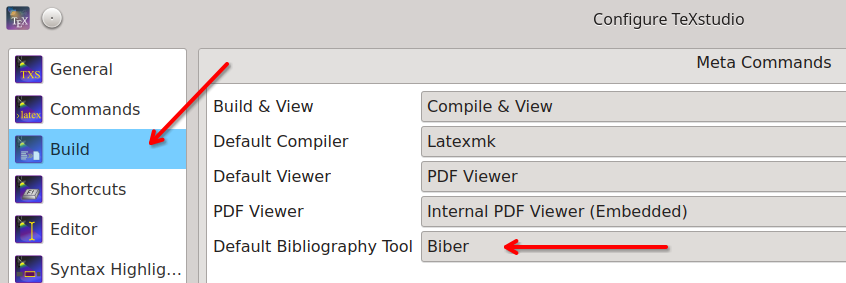
    - Click **OK** to save.

3. **Configure the default compiler**
TeXstudio is configured to use `latexmk` as the default compiler to automate the compilation process, including running Biber as needed.
	- Open TeXstudio configuration:
		- **Windows/Linux**: Go to **Options** > **Configure TeXstudio...**.
		- **macOS**: Go to **TeXstudio** > **Preferences...**
	- Select the **Build** tab in the left sidebar.
	- Find the **Default Compiler** drop-down menu.
	- Select **Latexmk** from the list 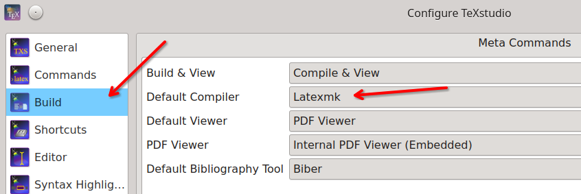

4. **Set a Build Directory**
Auxiliary files are moved to a `build/` subfolder to maintain a clean project directory.
	- In the **Commands** tab, modify the *Latexmk* command to include the output directory. Change it to: `latexmk -pdf -bibtex -shell-escape -emulate-aux-dir -output-directory=build -silent -synctex=1 %`
	- Update the *Biber* command to point directly to the build folder: `biber --output-directory build %`
	- The configuration shall look like this: 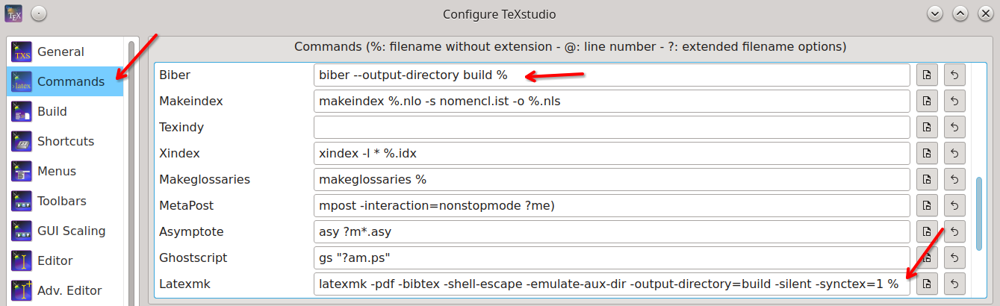
	- Enable **Show Advanced Options** at the bottom left of the configuration window.
	- In the **Build** tab, under **Additional Search Paths**, type `build` to both the **Log File** and **PDF File** fields so TeXstudio can still find them: 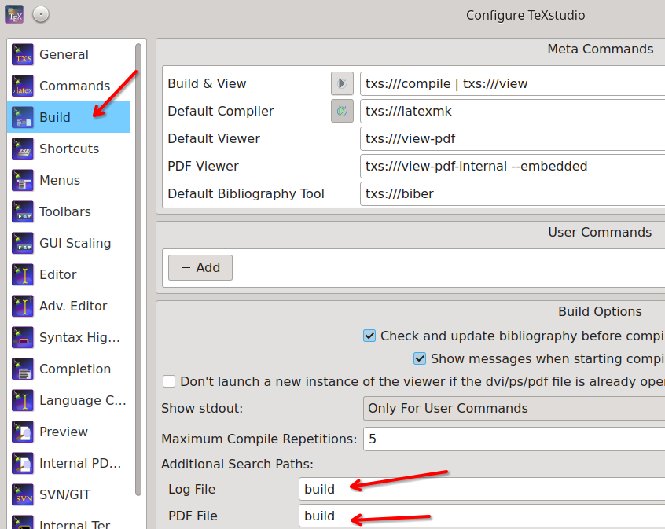
	- Click **OK** to save.

---

# 5 🚀 Getting started

> [!caution]
> Perform the template compilation prior to writing the thesis/work to ensure the toolchain is correctly configured.

* Get the code repository using one of the following methods.

**Direct download method:** 
1. Open the repository on a web-browser https://github.com/ceruleo-dev/fiuba-templates
2. Download and unzip the ZIP file: 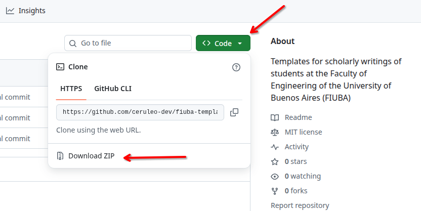

**Cloning the repository method (command line):**
1. Clone the repository:
```bash
git clone https://github.com/ceruleo-dev/fiuba-templates.git
```
2. Navigate to the thesis template:
```bash
cd fiuba-templates/FIUBA-thesis
```  


## 5.1 🧪 Compiling the Thesis

LaTeX requires a specific sequence of operations to link text, cross-references, acronyms and bibliographies. TeXstudio's "Build & View" tool automates the compilation sequence using the `latexmk` compiler as backend.

1. Open the `FIUBA-thesis-main.tex` file in TeXstudio.
2. Press the **F5** key (or click the double green arrow icon `►►` in the top toolbar).
3. TeXstudio will compile the document and generate a `build` directory containing the PDF and auxiliary files.
4. TeXStudio will open the generated PDF in the built-in viewer on the right side of the screen. Alternatively, open the PDF file in the `build` directory.

> [!info]
> To recompile everything from scratch delete the generated `build` directory.

## 5.2 📓Modifying the templates

> [!caution]
> Use the following file naming convention
> 
> **FRONT-MATTER** Any file related to the front matter of the thesis shall be named as `front-matter-FILENAME.tex`. The front matter serves as a guide for the reader. It is numbered using Roman numerals, usually containing:
> - **Title Page**: Contains the thesis title, author name, department, university, and date.
> - **Abstract**: A concise summary of the research questions, methods, and findings.
> - **Table of Contents**: Lists all chapters and subheadings with page numbers.
> - **Lists of Tables, Figures, and Illustrations**: Required if the document includes two or more of these elements.
> - **Optional Pages**: These may include a **Dedication/Epigraph**, **Acknowledgements**, **Preface**, and a **List of Abbreviations** or **Nomenclature**.
> 
> **MAIN BODY** Any file related to the main body of the thesis shall be named as `main-body-FILENAME.tex`. This section contains the core research and is numbered with Arabic numerals starting at page 1.
>
> **BACK-MATTER** Any file related to the back matter of the thesis shall be named as `back-matter-FILENAME.tex`. This section includes documentation and supplementary data that support the main text:
> - **Appendices**: Additional materials like survey questions, raw data, or technical proofs.
> - **Bibliography/References**: A complete list of all sources cited in the thesis (it is always defined in the `back-matter-bibliography.bib` file).
> - **Authorship declaration**: Declares the originality of the work and the usage of licensed tools, such as Artificial Intelligence ones.
> - **Curriculum Vitae (CV)**: Sometimes required at the very end of doctoral dissertations.

After confirming that the base template can be correctly compiled and visualized, modify it as needed.


> [!note]
> In what follows, we take the `Undergraduate Thesis` template as the primary example.

1. Open the `FIUBA-thesis-main.tex` file.
2. Complete the PDF settings requested information: 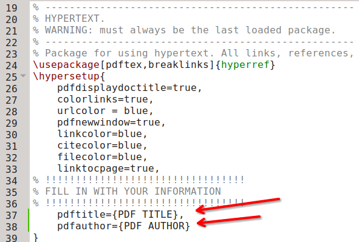
3. Select the type of thesis cover to use by commenting the two lines that do not correspond to the type of cover. In this case comment the *graduate* and *PhD* lines: 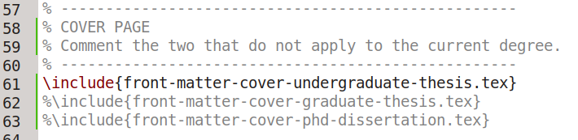
4. Open the `front-matter-cover-undergraduate-thesis.tex` file and complete the cover requested information. Delete the lines that do not correspond (e.g. maybe there is no co-director): 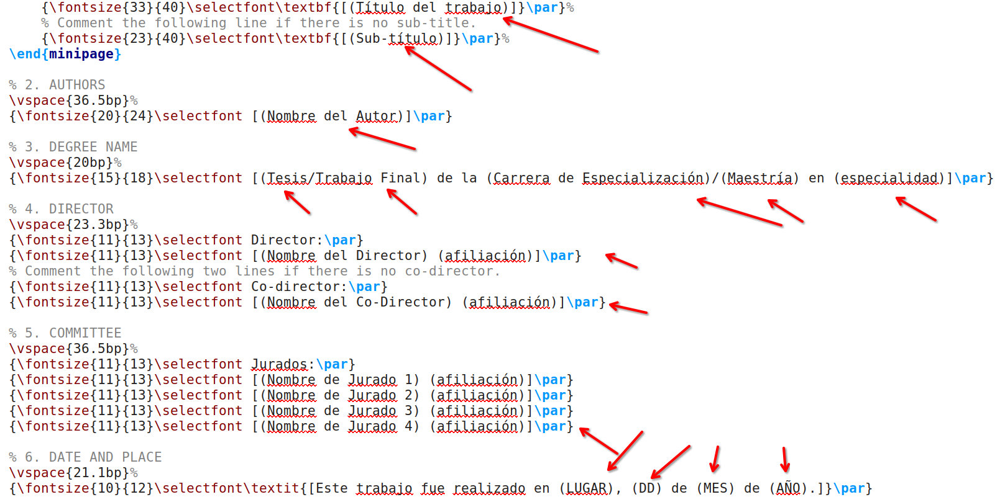
5. Do the same as the previous step for the following files:
	- `front-matter-signature.tex`
	- `front-matter-abstract.tex`
	- `front-matter-acknowledgements.tex`
	- `front-matter-epigraph.tex`
	- `back-matter-authorship-declaration.tex`
6. In the `FIUBA-thesis-main.tex` file there are some chapters and appendices as examples. They include random text and several code snippets showing how to write equations, cite references, use acronyms and managing code blocks. Take them as a baseline to write your own ones: 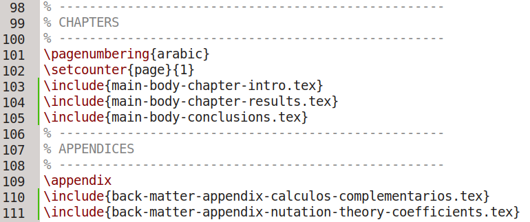
7. As your work evolves, add the corresponding acronyms in the file `front-matter-glossary.tex`.
8. [*BibTex*](https://www.bibtex.org/) is used to manage the bibliographic references. Modify the provided `back-matter-bibliography.bib` file using the examples as references. Read more about BibTex syntax [here](https://www.bibtex.org/Format/).

> [!tip]
> **Draft watermark**
> 
> To maintain version control throughout the iterative review process with supervisors and the committee, it is advisable to apply a **watermark** to the manuscript. This practice ensures that preliminary drafts are clearly distinguished from the **definitive, press-ready** version, thereby mitigating potential confusion during subsequent **revisions**. For example:
> 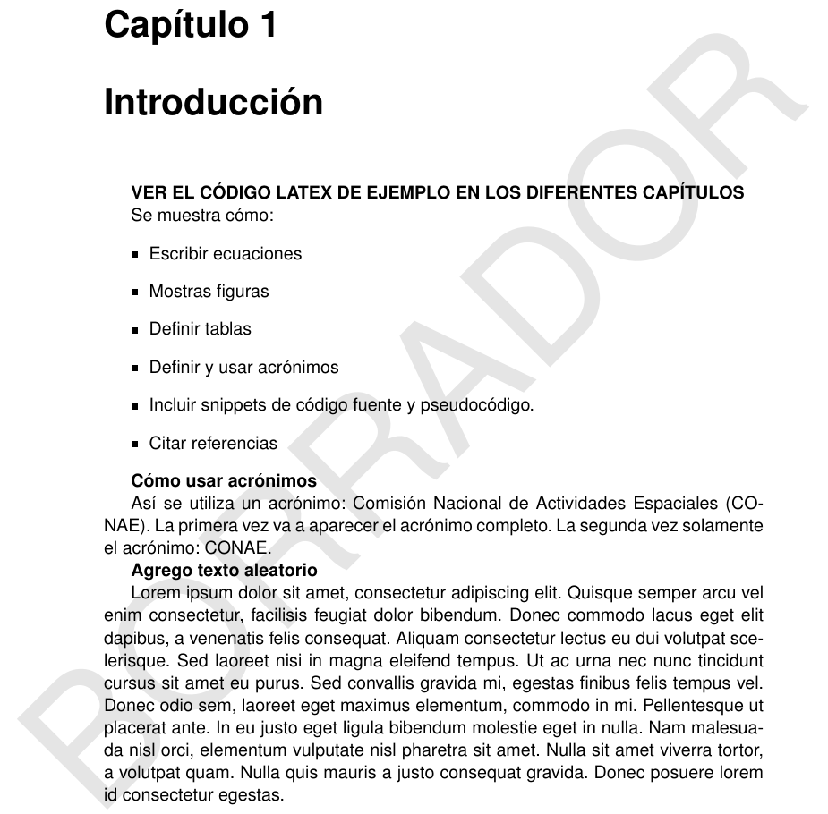
> The templates have a *watermark* section in the `FIUBA-thesis-main.tex` file:
> 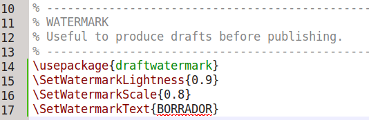
> Comment those lines to compile the definitive version of the document.


# 6 🤝 Contributing

Contributions are encouraged! 

If you have templates such as `TikZ` diagrams, a better way to format tables, or improvements to the class files, please open a Pull Request.

1. Fork the Project.
2. Create a Feature Branch (`git checkout -b feature/AmazingSnippet`).
3. Commit the Changes (`git commit -m 'Add ADCS block diagram snippet'`).
4. Push to the Feature Branch (`git push origin feature/AmazingSnippet`).
5. Open a Pull Request.

---

# 7 📚 Recommended LaTex learning material

1. Excellent tutorial to learn Latex in just 1 day.
	- [The not so Short Introduction to LaTeX2e](https://tobi.oetiker.ch/lshort/)
2. Excellent summary of the Latex syntax you will be using daily.
	- [Latex cheat-sheet](https://latex4ei.github.io/external/download/latex4ei_pdfs/LaTeX_CheatSheet.pdf)
3. Jump-start tutorial for writing math equations in Latex.
	1. [How to Typeset Equations in LaTeX](https://moser-isi.ethz.ch/docs/typeset_equations.pdf)
4. [Latex mathematical symbols list](https://latex4ei.github.io/external/download/latex4ei_pdfs/latexsymbols.pdf)
5. [Bibliography management with Bibtex](https://www.overleaf.com/learn/latex/Bibliography_management_with_bibtex)
6. Professional package to manage different physical units (e.g. mechanical units, electrical units, etc.).
	- [siunitx – A comprehensive (SI) units package](https://ctan.org/pkg/siunitx)
	- [User manual](https://mirrors.ctan.org/macros/latex/contrib/siunitx/siunitx.pdf)
7. [The Comprehensive LaTeX Symbol List](https://ctan.org/pkg/comprehensive)

---

# 📋 To-do list
- [ ] Add a template for FIUBA courses reports.
- [ ] Add a template for academic papers.

# 🫩 Authors

* **[Santiago Husain Cerruti](https://github.com/ceruleo-dev)** - hola santiago at proton dot me

# 📄 License

THIS WORK IS PROVIDED ON AN "AS IS" BASIS.  THE AUTHOR PROVIDES NO WARRANTY WHATSOEVER, EITHER EXPRESS OR IMPLIED, REGARDING THE WORK, INCLUDING WARRANTIES WITH RESPECT TO ITS MERCHANTABILITY OR FITNESS FOR ANY PARTICULAR PURPOSE.

Copyright (c) 2026 Santiago Husain Cerruti.
Distributed under the MIT License.
See `LICENSE` file for full text.
