Assortment of LaTex code snippets.

# 1. TEXT SNIPPETS.

> [!tip]
> **A standard quote**
> ```latex
> \enquote{This is a quote.}
> ```
> 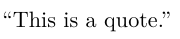

> [!tip]
> **A nested quote**
> Note that `csquotes` package handles the single quotes automatically.
> ```latex
> \enquote{The witness stated, \enquote{I saw nothing} during the trial.}
> ```
> 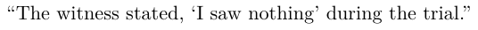

> [!tip]
> **Acronyms definitions.**
> * In the `\misc\glossary.tex` file, define acronyms using the `\newacronym` command.
> * Usage: `\newacronym[acronym_reference]{acronym}{description}`, where `acronym_reference` will be used to reference the acronym in the document.
> * Definition (in `\misc\glossary.tex`):
> ```latex
> \newacronym{sfu}{SFU}{Solar Flux Unit}
> ```
>  * Usage in the document (after the `\begin{document}` command). The first usage $\LaTeX$ will output the complete definition of the acronym:
>  ```latex
> An acronym is used like this: \gls{SFU}
> ```
> 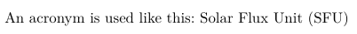
> * The rest of the times the acronym will appear as a single word:
>  ```latex
> From now on, any use of the acronym \LaTeX will display it as a single word: \gls{SFU}.
> ```
> 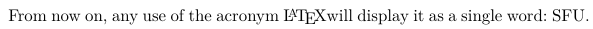

> [!tip]
> **How add bibliographic references and cite them**
> 1. Add the bibliographic entry in the `bibliography/main.bib` file. Note that the provided templates already have many examples of books, articles, etc. as example. Delete them and add yours. For example:
> ```latex
> @article{paper_servidia2021,
> 	author = "P. A. Servidia and M. España",
> 	title = "On Autonomous Reconfiguration of SAR Satellite Formation Flight With Continuous Control",
> 	journal = "IEEE Tran. on Aero. and Elec. Systems",
> 	volume = "57",
> 	year = "2021",
> 	month = "April"
> }
> ```
> 2. In the document, cite the reference as per the preferred style:
> ```latex
> \cite{paper_servidia2021}
> \begin{enumerate}
> 	\item \parencite[10--100]{paper_servidia2021}
> 	\item \textcite[10--100]{paper_servidia2021}
> 	\item (\textcite[10--100]{paper_servidia2021})
> 	\item \citeauthor{paper_servidia2021}
> \end{enumerate}
> ```
> 3. The results are these:
> 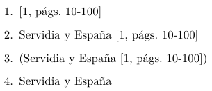

---
# 2. FIGURES AND TABLES SNIPPETS

* The images must be inside the `includes` directory. E.g. `includes/Logo_UBA` or `includes/EPS_FIGURE`.
* It is highly recommended to use vectorized EPS images to avoid losing image quality.
* If I include figures from MatLab, they shouldn't be saved in maximized (full screen size) mode.

> [!tip]
> **Basic figure inclusion**
> ```latex
> \begin{figure}[!ht]
> 	\centering
> 	\includegraphics[scale=0.8]{media/EPS_FIGURE}
> 	\caption{Vectorized figure example.}
> 	\label{ex1_N5}
> \end{figure}
> ```
> 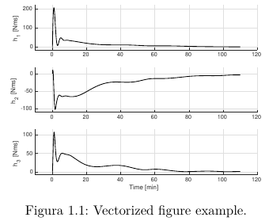

> [!tip]
> **Side-by-side figures**
> ```latex
> \begin{figure}[H]
> 	\centering
> 	\begin{subfigure}[c]{0.3\textwidth}
> 		\includegraphics[scale=0.06]{media/Logo_UBA}
> 	\end{subfigure}
> 	\begin{subfigure}[c]{0.3\textwidth}
> 		\includegraphics[scale=0.5]{media/Logo_FIUBA}
> 	\end{subfigure}
> \end{figure}
> ```
> 

> [!tip]
> **A good looking table**
> ```latex
> \begin{table}
> 	\caption{Good looking table using booktabs}
> 	\centering
> 	\label{table:good_table}
> 	\begin{tabular}{l c c c c}
> 		\toprule
> 		\multirow{2}{*}{Dental measurement} & \multicolumn{2}{c}{Species I} & \multicolumn{2}{c}{Species II} \\
> 		\cmidrule{2-5}
> 		& mean & SD  & mean & SD  \\
> 		\midrule
> 		I1MD & 6.23 & 0.91 & 5.2  & 0.7  \\
>
> 		I1LL & 7.48 & 0.56 & 8.7  & 0.71 \\
>
> 		I2MD & 3.99 & 0.63 & 4.22 & 0.54 \\
>
> 		I2LL & 6.81 & 0.02 & 6.66 & 0.01 \\
>
> 		CMD & 13.47 & 0.09 & 10.55 & 0.05 \\
>
> 		CBL & 11.88 & 0.05 & 13.11 & 0.04\\
> 		\bottomrule
> 	\end{tabular}
> \end{table}
> ```
> 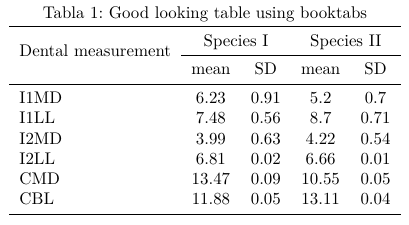

---
# 3. MATHS SNIPPETS.
* Use the one you like.
* `IEEEeqnarray` environment is recommended.

> [!tip]
> **Related equations**
> ```latex
> \begin{IEEEeqnarray}{rCl}
> 	\IEEEyesnumber\label{ec_ex1_relaciones} \IEEEyessubnumber*
> 	x\left( n \right)  \  &=& \, x\left( n + k \, N \right) \label{ec_ex1_x}\\
> 	y\left( n \right)  \, &=& \, y\left( n + l \, L \right) \label{ec_ex1_y}\\
> 	y\left( n \right)  \, &=& \, x\left( M \, n \right) \label{ec_ex1_downsampling}
> \end{IEEEeqnarray}
> ```
> 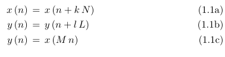

> [!tip]
> **How to reference the equations of the previous snippet**
> ```latex
> ...where the set of equations \eqref{ec_ex1_x}, \eqref{ec_ex1_y} and \eqref{ec_ex1_downsampling} is referred to as \eqref{ec_ex1_relaciones}.
> ```
> 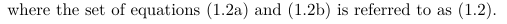

> [!tip]
> **Using `align` environment**
> ```latex
> \begin{align}
> 	N_{x,sk} &= k_{sk}\left(\frac{t_{sk}}{b_{sk}}\right)^{2}\bar{Et}\nonumber\\
> 	N_{x,st} &= k_{st}\left(\frac{t_{st}}{b_{st}}\right)^{2}\bar{Et}
> \end{align}
> ```
> 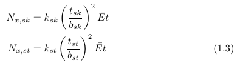

> [!tip]
> **Aligned equations using `IEEEeqnarray` style**
> ```latex
> \begin{IEEEeqnarray}{CCC}
> 	\IEEEyesnumber\label{eq:both} \IEEEyessubnumber*
> 	\text{Aligned equation 1:} A &=& C \label{eq:sub1}\\
> 	\text{Aligned equation 2:} B &=& D  \label{eq:sub2}
> \end{IEEEeqnarray}
> ```
> 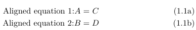

> [!tip]
> **`IEEEeqnarray` with matrices**
> ```latex
> \begin{IEEEeqnarray}{rCl}
> 	a = \left[
> 	\begin{matrix}
> 		A & B \\
> 		D & E \\
> 	\end{matrix} \right. \quad &\ldots& \nonumber \\
> 	&\ldots& \left.
> 	\begin{matrix}
> 		C \\
> 		F
> 	\end{matrix} \right]
> \end{IEEEeqnarray}
> ```
> 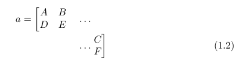

> [!tip]
> **`equation` environment**
> ```latex
> \begin{equation}
> 	\begin{cases}
> 		H\left( z \right) &= \sum_{l=0}^{M-1} \, z^{-l} \, E_l\left( z^M \right) \\
> 		E_l\left( z \right) &= \sum_{n=-\infty}^{+\infty} \, e_l \left( n \right) \, z^{-n} \\
> 		e_l\left( n \right) &= h\left(n\,M + l\right) \quad 0 \leq l \leq M-1
> 	\end{cases}
> \end{equation}
> ```
> 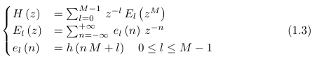

> [!tip]
> **`equation` environment using matrices**
> ```latex
> \begin{equation}
> 	\mathbf{R}_x\left(\phi\right) =
> 	\begin{bmatrix}
> 		1 & 0 & 0 \\
> 		0 & \cos \left(\phi\right) & \sin \left(\phi\right) \\
> 		0 & -\sin \left(\phi\right) & \cos \left(\phi\right) \\
> 	\end{bmatrix}
> \end{equation}
> ```
> 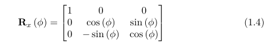

> [!tip]
> **Differentials and derivatives**
> * Differentials
> ```latex
> $\odif{x}$
> ```
> * Ordinary Derivatives
> ```latex
> $\odv[order=n]{f}{x}$
> ```
> * Partial Derivatives
> ```latex
> $\pdv[order=n]{f}{x}$
> ```
> * Simple Mixed Partial Derivatives.
> ```latex
> $ \pdv{f}{x,y} $
> $ \pdv{Q}{x,y,z} $
> ```
> 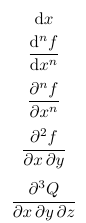

> [!tip]
> **Higher-Order Mixed Partial Derivatives**
> If you need multiple derivatives of the same variable (e.g., differentiating twice with respect to $x$ and three times with respect to $y$), you use the optional `order={...}` argument. You pass it a comma-separated list of the powers that corresponds to your variables.
>
> * Differentiate twice by x, and three times by y
> ```latex
> $ \pdv[order={2,3}]{f}{x,y} $
> ```
> * You can even use abstract variables like `n` or `\alpha`
> ```latex
> $ \pdv[order={n, \alpha}]{f}{x,y} $
> ```
> 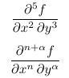

> [!tip]
> **Derivatives Lower/Upper Evaluation Limits**
> To evaluate a derivative at a single point, just add a subscript to the very end of the `\odv` command:
> ```latex
> $\odv{f}{x}_{x=0}$
> ```
> 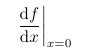
> If you need to show an evaluation across a range or boundaries, add both a subscript and a superscript.
> ```latex
> $\odv{y}{t}_{t=0}^{t=5}$
> ```
> 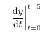
> * **Note:** If you ever write compact, inline derivatives using the starred version of the command (e.g., `$\odv*{f}{x}_{x=0}$`), the package is smart enough to scale the vertical evaluation bar down automatically to match the inline fraction style.

> [!tip]
> **Integrals**
> Basic usage:
> ```latex
> \int x^2 \odif{x}
> ```
> Multi-line limits: Stack the conditions on top of each other using the `\substack{...}` command provided by `amsmath` package. You use standard line breaks `\\` inside the stack.
> ```latex
> \iint\limits_{\substack{0 \le x \le 1 \\ 0 \le y \le 1}} f(x,y) \mathrm{d}x \mathrm{d}y
> ```
> 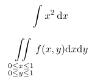

> [!tip]
> **Absolute value and norm operators**
> Standard Size (no star `*`): Use this for regular, inline variables or basic equations. It keeps the brackets the same height as standard text, which prevents awkward line-spacing issues in your paragraphs.
> ```latex
> The absolute value of $x$ is $\abs{x}$, and the norm of the vector is $\norm{v}$.
> ```
> 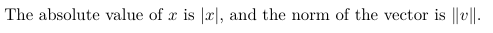
> Auto-Scaling (With a Star): Use the starred version (`*`) whenever you have tall math, like fractions, matrices, or integrals. This tells LaTeX to automatically apply `\left` and `\right` to stretch the bars to perfectly match the height of the contents.
> ```latex
> \abs*{\frac{x^2 - 1}{x + 1}} = 5
> \norm*{ \begin{bmatrix} 1 \\ -2 \\ 3 \end{bmatrix} }
> ```
> 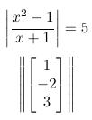
> Note what happens when we don't scale the operators:
> ```latex
> \abs{\int x^2 \odif{x}}
> \norm{\int x^2 \odif{x}}
> ```
> 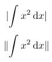
> So we must use proper scaling:
> ```latex
> \abs*{\int x^2 \odif{x}}
> \norm*{\int x^2 \odif{x}}
> ```
> 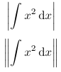

> [!tip]
> **Set Builder Notation command**
> Instead of typing the curly braces and the \mid manually, you just wrap everything in the \set command and use \given wherever you want the vertical separator. It inherits all the exact same scaling tricks (starred, standard, and manual) that \abs and \norm have.
> Standard Size
> ```latex
> \set{ x \given x > 0 }
> ```
> Auto-scaling (Starred) with a tall fraction
> ```latex
> \set*{ x \in \mathbb{R} \given \frac{x^2}{2} > 5 }
> ```
> 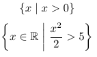

> [!tip]
> **Automatic Scaling Brackets**
> When you write equations with tall elements like fractions or matrices, standard parentheses ( and ) stay small and look awkward. While typing \left( and \right) fixes this, doing it every single time gets exhausting and clutters your code.
> Whenever you use these commands with a star (`*`), LaTeX will automatically apply `\left` and `\right` to scale them perfectly to whatever is inside. If you use them without a star, they stay standard size.
> The old, ugly way (small brackets around a tall fraction)
> ```latex
>  ( \frac{1}{2} )
> ```
> The old, tedious way
> ```latex
>  \left( \frac{1}{2} \right)
> ```
> The fast, modern way with auto-scaling
> ```latex
>  \paren*{\frac{1}{2}}
> ```
> Works seamlessly with tall matrices too
> ```latex
>  \sqbrac*{ \begin{matrix} 1 & 2 \\ 3 & 4 \end{matrix} }
>  \abs*{\frac{x^2 - 1}{x + 1}}
>  ```
>  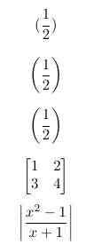

> [!tip]
> **Automatic matrix transposition.**
> Original matrix
> ```latex
> \begin{bmatrix}
> 	1 & 2 & 3 \\
> 	4 & 5 & 6
> \end{bmatrix}
> ```
>
> Transposed matrix
> ```latex
> \begin{bmatrixT}
> 	1 & 2 & 3 \\
> 	4 & 5 & 6
> \end{bmatrixT}
> ```
>
> Transpose with parentheses
> ```latex
> \begin{pmatrixT}
> 	a & b \\
> 	c & d
> \end{pmatrixT}
> ```
>
> Transpose with vertical determinant bars
> ```latex
> \begin{vmatrixT}
> 	1 & 2 & 3 \\
> 	4 & 5 & 6
> \end{vmatrixT}
> ```
> 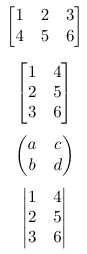

> [!tip]
> **Commands to typeset boldface vectors and matrices.**
> ```latex
> \vecbf{v}
> \mVec{v}
> \Mat{M}
> ```
> 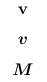

> [!tip]
> **Commands to typeset quaternions and its basic operations**
> ```latex
> \quat{q}
> \quatComp{a}{b}
> \quatConj{a}
> \quatRot{a}{b}
> ```
> 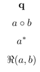

> [!tip]
> **Typeset vectors that have a 'hat' element.**
> Vector estimate.
> ```latex
> \vechat{a}
> ```
> Unit vector
> ```latex
> \vecunit{a}
> ```
> Vector derivative.
> ```latex
> \vecdot{a}
> ```
> 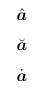

> [!tip]
> **Misc examples of useful equations typesetting.**
> Vector product.
> ```latex
> \vecprod{a}{b}
> ```
> Newton's Second Law can be written as:
> ```latex
> \mVec{F} = m \vecddot{r}
> ```
> The derivative of acceleration is jerk:
> ```latex
> \mVec{j} = \vecdddot{r}
> ```
> Estimated variable.
> ```latex
> \widehat{x} \quad \widehat{M} \quad \widehat{\mVec{v}} \quad \widehat{AB}
> ```
> 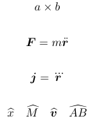

> [!tip]
> **Imaginary unit.**
> ```latex
> \iu
> ```
> 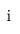

> [!tip]
> **Mathematical object definition.**
> ```latex
> \defineEq
> ```
> 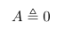

> [!tip]
> **Typesetting angles.**
> ```latex
> \ang{45}
> \ang{10; 20; 30}
> ```
> 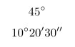

> [!tip]
> **Scientific numbering**
> ```latex
> \ang{23.43929111}
> \ang{;;46.8150}
> \pm \SI{0.9}{\second}
> \SI{1e-22}{}
> ```
> 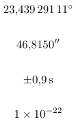
> Inline numbering
> ```latex
> ...utilizando mediciones en tierra de $F_{\SI{10.7}{}}$: Al dejar vacío el segundo argumento, lo que hace es usar el formato numérico SI, y no el local. O sea, aparece \enquote{10.7} en vez de \enquote{10,7}.
> ```
> 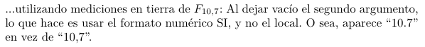

---
# 4. SOURCE CODE SNIPPETS.

> [!tip]
> **Pseudocode example**
> ```latex
> \begin{algorithm}[!ht]
> 	\caption{Pseudocódigo del algoritmo euclídeo extendido}\label{alg_euc_ex}
> 	\begin{algorithmic}[1]
> 		\Require $H_0\left(z\right)$ y $H_1\left(z\right)$ coprimos
> 		\Ensure  $F_0\left(z\right)$ y $F_1\left(z\right)$ tales que $H_0\left(z\right)\cdot F_0\left(z\right)+H_1\left(z\right)\cdot F_1\left(z\right) = c$, con $c\neq0$. Además, $gr\left(F_0\right) < gr\left(H_1\right) - gr\left(g\right)$ y $gr\left(F_1\right) < gr\left(H_0\right) - gr\left(g\right)$.
> 		\Statex
> 		\Procedure{extEuclidean}{}
> 		\Statex
> 		\State Inicialización.
> 		\Statex
> 		\State $r_0=H_0 \quad r_1=H_1 \quad s_0=1 \quad s_1=0 \quad t_0=0 \quad t_1=1 \quad i=1$
> 		\Statex
> 		\While {$r_i\neq0 \quad\wedge\quad gr\left(r_{i+1}\right)\geqslant gr\left(r_i\right)$:}
> 		\Statex
> 		\State $q \leftarrow$ Cociente de $r_{i-1}/r_i$
> 		\Statex
> 		\State $r_{i+1} = r_{i-1} - q\,r_i$
> 		\Statex
> 		\State $s_{i+1} = s_{i-1} - q\,s_i$
> 		\Statex
> 		\State $t_{i+1} = t_{i-1} - q\,t_i$
> 		\Statex
> 		\State $i = i+1$
> 		\EndWhile
> 		\Statex
> 		\State $F_0\left(z\right) = s_{i-1} \quad F_1\left(z\right)=t_{i-1} \quad g=r_{i-1}$
> 		\EndProcedure
> 	\end{algorithmic}
> \end{algorithm}
> ```
> 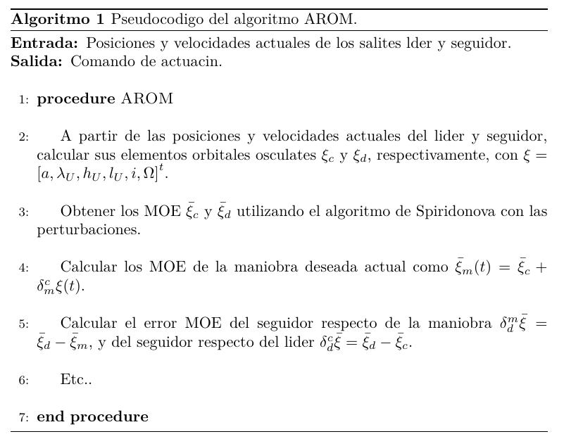

> [!tip]
> **C++ language snippet**
> ```latex
> \begin{lstlisting}[language=C++, style=StyleC, caption={Snippet}]
> 	typedef boost::interprocess::deque<Command, allocator_t> deque_t;
> 	typedef boost::interprocess::interprocess_mutex mutex_t;
> 	typedef boost::interprocess::scoped_lock<mutex_t> scoped_lock_t;
> 	typedef boost::interprocess::managed_shared_memory managed_shared_memory_t;
> \end{lstlisting}
> ```
> 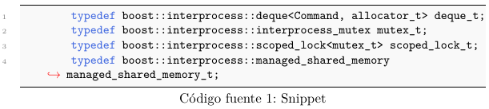

> [!tip]
> **Linux terminal view**
> ```latex
> \begin{lstlisting}[style=terminal, caption={Vista desde una terminal Linux.}]
> 	$ g++ -Wall -pedantic main.cpp -o programa
> 	$ ./programa
> 	Hola Mundo!
> \end{lstlisting}
> ```
> 

---


